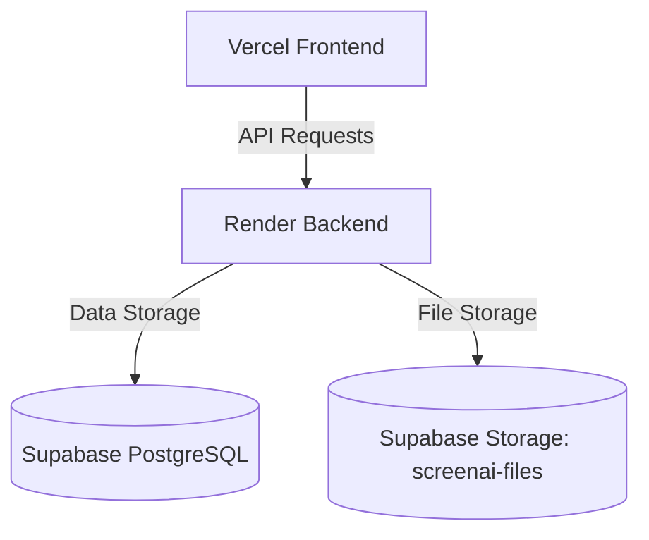

# ScreenAI Production Deployment Guide

This guide outlines instructions for deploying **ScreenAI** to a free cloud production stack: **Render** (Backend API), **Vercel** (Frontend SPA), and **Supabase** (PostgreSQL Database & S3-compatible File Storage).

---

## Architecture Overview



---

## 1. Supabase Database & S3 Storage Configuration

### A. Database Connection URL
1. Sign in to your [Supabase Dashboard](https://supabase.com).
2. Create or select a project.
3. Navigate to **Project Settings** > **Database** > **Connection string**.
4. Copy the connection URL (`postgresql://...`). Make sure to append SSL options if required (Supabase defaults to requiring SSL).

### B. S3-Compatible Storage Bucket
1. Create a **Private** bucket named `screenai-files` in **Supabase Storage**.
2. Navigate to **Project Settings** > **API**.
3. Under the **S3 Connection** section (if available) or by using custom access keys, retrieve:
   - **S3 Endpoint URL** (e.g., `https://<project-ref>.supabase.co/storage/v1/s3`)
   - **Access Key ID**
   - **Secret Access Key**
   - **Region** (typically `us-east-1` or your Supabase project region)
4. Ensure your S3 credentials have read/write access to the `screenai-files` bucket.

---

## 2. Render Backend Deployment

### A. Set Up Web Service on Render
1. Connect your repository to your [Render Dashboard](https://dashboard.render.com).
2. Click **New** > **Web Service**.
3. Set the following options:
   - **Name:** `screenai-backend`
   - **Language:** `Python`
   - **Branch:** `main` (or your active release branch)
   - **Root Directory:** `backend`
   - **Build Command:** `pip install -r requirements.txt && python manage.py collectstatic --noinput && python manage.py migrate`
   - **Start Command:** `gunicorn screenai.wsgi:application`
   - **Instance Type:** `Free` (or custom tier)

### B. Add Environment Variables
Add the following key-value pairs in **Settings** > **Environment**:

| Environment Variable | Recommended Value / Notes |
|---|---|
| `DJANGO_DEBUG` | `False` |
| `DJANGO_SECRET_KEY` | Generate a secure secret (e.g., `openssl rand -hex 32`) |
| `DATABASE_URL` | Your Supabase PostgreSQL connection string |
| `DATABASE_CONN_MAX_AGE` | `60` (keeps connections alive for performance) |
| `DJANGO_ALLOWED_HOSTS` | Your Render web service host (e.g., `screenai-backend.onrender.com`) |
| `CORS_ALLOWED_ORIGINS` | Your Vercel frontend host (e.g., `https://screenai.vercel.app`) |
| `CSRF_TRUSTED_ORIGINS` | Your Vercel frontend host (e.g., `https://screenai.vercel.app`) |
| `TRUST_PROXY_HEADERS` | `True` |
| `SUPABASE_STORAGE_ENABLED` | `True` |
| `SUPABASE_STORAGE_BUCKET` | `screenai-files` |
| `SUPABASE_S3_ENDPOINT_URL` | Your Supabase S3 endpoint URL |
| `SUPABASE_S3_ACCESS_KEY_ID` | Your Supabase S3 Access Key |
| `SUPABASE_S3_SECRET_ACCESS_KEY` | Your Supabase S3 Secret Key |
| `SUPABASE_S3_REGION` | Your Supabase region |
| `SUPABASE_STORAGE_URL_EXPIRY_SECONDS` | `3600` (1 hour) |
| `EVALUATION_ENABLED` | `False` (disables Docker grading for Render free-tier compatibility) |
| `GEMINI_API_KEY` | Your Google Gemini API Key |
| `BREVO_API_KEY` | Your Brevo SMTP API Key (if email invitation enabled) |

### C. Configure Health Check on Render
Navigate to **Advanced Settings** > **Health Check Path** and set it to `/api/health/`. Render will use this endpoint to verify zero-downtime deploys.

---

## 3. Vercel Frontend Deployment

### A. Set Up Vercel Project
1. Import your repository into [Vercel](https://vercel.com).
2. Configure the project:
   - **Framework Preset:** `Vite` (or `Other` if using generic root config)
   - **Root Directory:** `frontend`
   - **Build Command:** `npm run build`
   - **Output Directory:** `dist`

### B. Add Environment Variables
Add the following Environment Variables in Vercel:

| Environment Variable | Value |
|---|---|
| `VITE_API_BASE_URL` | `https://screenai-backend.onrender.com/api` (your backend URL + `/api`) |
| `VITE_ASSESSMENT_INVITATIONS_ENABLED` | `true` (or `false` to deactivate) |
| `VITE_EVALUATION_ENABLED` | `false` (hides run code/tests options during evaluation outage) |

### C. SPA Routing Configuration
Vercel requires rewrite rules to support client-side SPA routing. The repository includes `frontend/vercel.json` preconfigured with:
```json
{
  "rewrites": [
    { "source": "/(.*)", "destination": "/index.html" }
  ]
}
```

---

## 4. Post-Deployment Steps

### Creating a Django Superuser
Since Render Free Tier does not provide an interactive shell to run `createsuperuser` manually:
1. Navigate to your Render **Dashboard** for `screenai-backend`.
2. Click **Shell** in the sidebar.
3. Run the following command non-interactively using Python:
   ```bash
   python manage.py shell -c "from django.contrib.auth.models import User; User.objects.create_superuser('admin', 'admin@example.com', 'YourStrongPassword')"
   ```
4. Verify you can sign in to the Django admin panel at `https://screenai-backend.onrender.com/admin/`.
